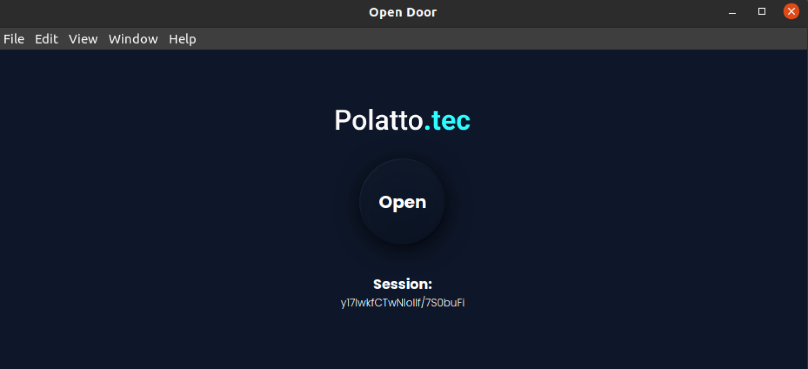

<h1 align="center">
    
</h1>

<p align="center">
  
</p> </br>
<p align="center">
  This project was developed to access a <a href='https://www.controlid.com.br/controle-de-acesso/'>control ID</a> access controller, where the customer needed the receptionist to unlock the door without having to go to the buttonhole was installed. The controller has a public API, which facilitated remote access.
</p>

## Getting started

Clone the project and access the folder

```bash
$ git clone https://github.com/devpolatto/openDoor-Reactron.git
```

Download the dependencies and then run the app

```bash
# Install the dependencies
$ yarn install
```

<p align="left">
To run the application, first of all you need to change the settings in config.js with your device data. The Application must be on the same network as the controller
</p>

```bash
# config.js
export const keys = {
     host: "IP Address",
     user: "",
     password: ""
}
```
<p align="left">
Run the app
</p>

```bash
# Start the project
$ yarn electron
```
